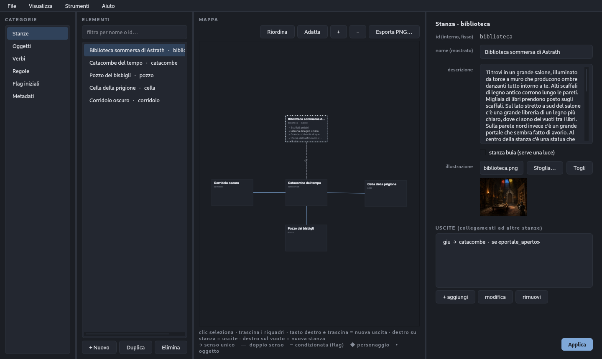

<p align="center">
  
</p>

<p align="center"><i>Crea avventure testuali — stile Zork e Avventura nella Caverna — senza scrivere una riga di codice.</i></p>

---

<p align="center">
  
</p>
<p align="center"><sub>Pasifae Editor: la mappa è il piano di lavoro — trascini le stanze, crei le uscite col mouse, i dettagli si modificano a lato.</sub></p>

## Cos'è Pasifae

**Pasifae** è una suite per creare e giocare **avventure testuali** (interactive
fiction): quei giochi in cui esplori un mondo digitando comandi come «vai a
nord», «prendi la chiave», «apri la porta». Con Pasifae costruisci il tuo mondo
— stanze, oggetti, personaggi, enigmi — riempiendo moduli e scegliendo da menù,
senza programmare. Il nome richiama il mito del labirinto, e il labirinto è
proprio ciò che intreccia chi scrive un'avventura.

Il principio di fondo è semplice: **un'avventura è un insieme di dati**, non un
programma. Tu descrivi il mondo e le sue regole; il motore le fa funzionare.

## La suite

- **Pasifae Editor** — l'editor grafico con cui costruisci l'avventura: mappa,
  oggetti, regole, dialoghi, con prova giocabile integrata, mappa visuale,
  pannello dei problemi dal vivo, ricerca trasversale e **compilazione del gioco
  in un eseguibile autonomo** (Strumenti ▸ Compila gioco) da distribuire a chi
  non ha Pasifae.
- **Pasifae Play** — il player con cui tu o i tuoi giocatori giocate
  l'avventura salvata.
- **Pasifae Engine** (`advcore`) — il motore condiviso, senza I/O: riceve una
  stringa e restituisce una stringa. È il cuore affidabile e collaudato su cui
  poggiano editor e player.

Oltre alla suite grafica restano disponibili i front-end da terminale: un editor
testuale (`edit.py`, urwid) e un player a riga di comando (`play.py`).

## Avvio rapido

```bash
# interfaccia grafica (consigliata)
python3 -m gui.editor [avventura.json]     # Pasifae Editor
python3 -m gui.player [avventura.json]     # Pasifae Play

# front-end da terminale
python3 edit.py [avventura.json]           # editor testuale
python3 play.py  avventura.json            # player a riga di comando
```

Avventure di esempio in [`avventure/`](avventure/) (caverna, faro, duello,
tutorial, Il labirinto). Per imparare a usare l'editor, vedi il **manuale d'uso** (Word/PDF) e,
per chi sviluppa, la documentazione del motore in
[`advcore/DOCUMENTAZIONE.md`](advcore/DOCUMENTAZIONE.md).

## Architettura

Editor e player non si conoscono: dialogano solo tramite il file di gioco JSON e
condividono il modello via `advcore`.

```
            scrive                 legge ed esegue
  Editor  ───────────►  gioco.json  ◄───────────  Player
     └──────────────►  advcore  ◄──────────────────┘
                    (Pasifae Engine)
```

Cardine del progetto: **il motore è senza I/O**. `Motore.esegui(stringa)`
restituisce una stringa, non sa nulla dell'interfaccia. Così è testabile senza
schermo e riusabile (web, bot, …); le interfacce sono gusci sottili.

## Struttura dei file

```
advtext/
├── advcore/              # Pasifae Engine — nucleo condiviso (niente I/O)
│   ├── model.py          #   dataclass: Mondo, Stanza, Oggetto, Verbo, Regola
│   ├── engine.py         #   Motore: parser + regole + verbi predefiniti
│   ├── parser.py         #   verbo + preposizione + oggetto
│   ├── rules.py          #   condizioni ed effetti (con NON/OR/confronti)
│   ├── testo.py          #   testo dinamico ({flag} e [frammenti])
│   ├── storage.py        #   carica/salva l'avventura (JSON)
│   ├── salvataggio.py    #   salva/carica lo stato della partita
│   ├── validazione.py    #   controlli statici dell'avventura
│   └── mappa.py          #   mappa testuale (ASCII)
├── gui/                  # suite grafica (PySide6/Qt)
│   ├── editor.py         #   Pasifae Editor
│   ├── player.py         #   Pasifae Play
│   ├── assets/           #   logo e icone
│   └── …                 #   regole, mappa, anteprima, analisi, tema
├── avventure/            # avventure di esempio
├── edit.py · play.py     # front-end da terminale
└── test_*.py             # suite di test (motore + GUI)
```

## Test

```bash
python3 test_motore.py           # motore
pytest test_gui.py               # interfaccia (richiede requirements-dev.txt)
```

Regola pratica del progetto: quando emerge un bug, prima si aggiunge il test che
lo cattura, poi si corregge. Il motore evolve per aggiunte retrocompatibili,
mantenendo verde l'intera suite.

## Licenza

Pasifae è **software libero**, distribuito sotto **GNU General Public License
v3.0 o successiva** (`GPL-3.0-or-later`). Sei libero di usarlo, studiarlo,
modificarlo e ridistribuirlo; le versioni modificate che distribuisci devono
restare sotto la stessa licenza e con il codice sorgente disponibile. Il testo
completo è nel file [`LICENSE`](LICENSE).

> Copyright (C) 2026 Vito Antonio Raimondi

Pasifae usa librerie di terze parti (PySide6/Qt sotto LGPL-3.0, PyInstaller,
urwid): vedi [`THIRD-PARTY-NOTICES.md`](THIRD-PARTY-NOTICES.md) per le condizioni
da rispettare quando distribuisci la suite o i giochi compilati.

---

<p align="center"><i>Pasifae — costruisci mondi di parole.</i></p>
